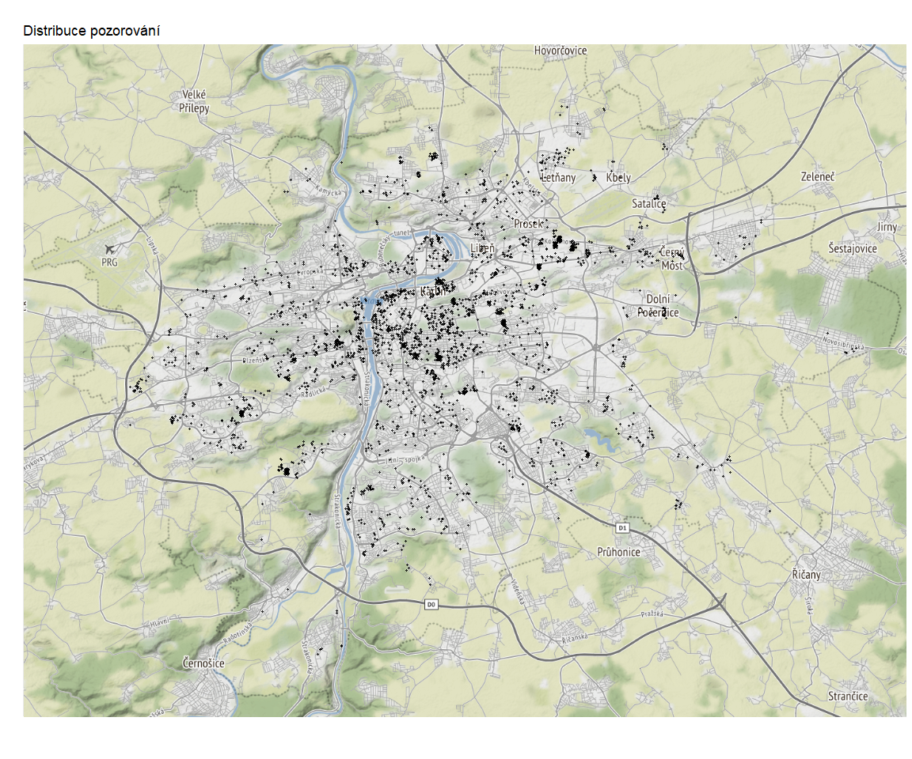

Prostorové modely na Pražském trhu nemovitostí
================
Petr Hrobař

In this study we apply ***Spatial Econometrics models*** and evaluate
flats prices. We suppose that **price** of the flat is not only the
function of flat’s own characteristics but also function of its
neighbourhood characteristics.

  - Firstly we test for spatial dependency
  - Then applying spatial models

Data Distribution:
<!-- -->
